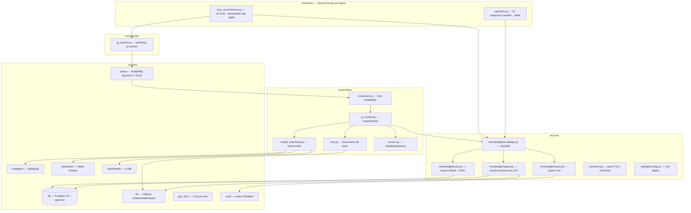
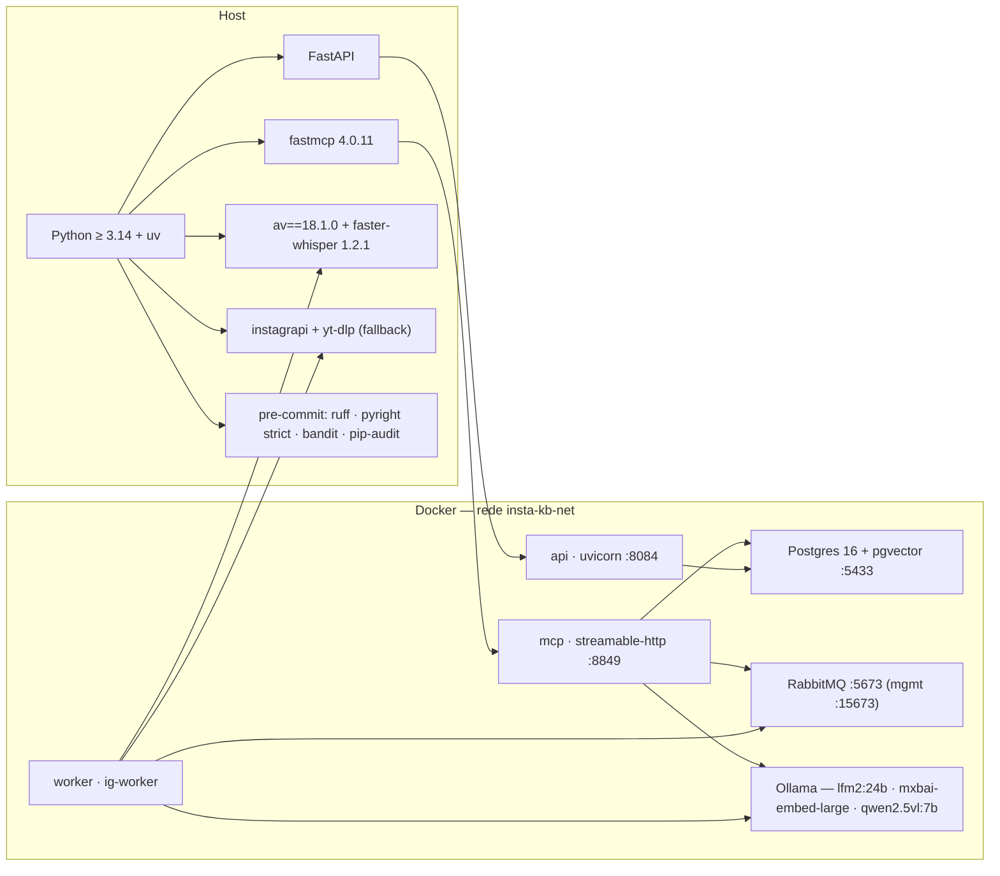
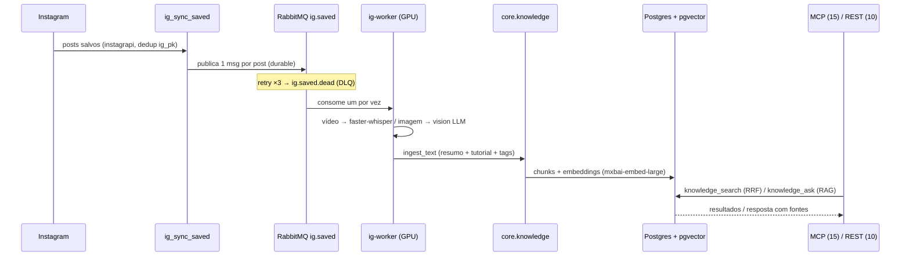

# Arquitetura — insta_kb

Três leituras do mesmo sistema: o que existe (estrutura), com que é feito
(stack) e como os dados correm (fluxo). Visão geral na
[home](index.md); detalhes operacionais no `HANDOFF.md` do repositório.

## Estrutura

## Stack

## Fluxo

